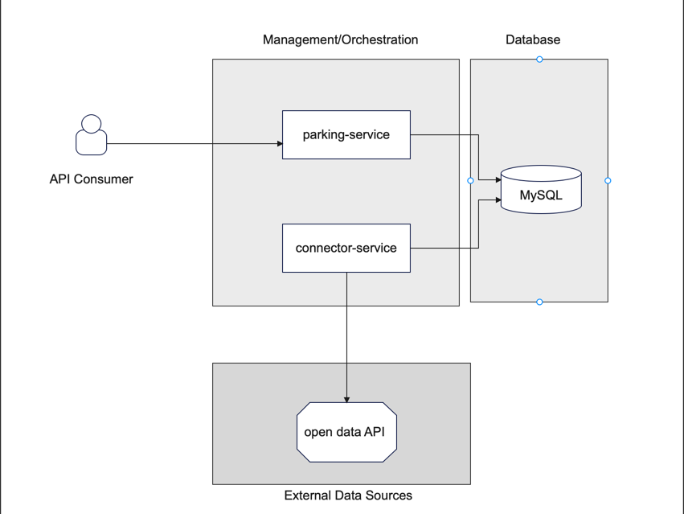

## Table of Contents

1. [Parking service](#parkingservice)
2. [Connector service](#connectorservice)
3. [Sample Data Response](#sample-data-response)


# Architecture 


<div align="center">
  
</div>


# Parking service <a name="parkingservice"></a>

Spring Boot + Hibernate Spatial

## How to run

#### using mvn


```
mvn spring-boot:run
```

#### using database in docker

**REQUIRED: Docker is running**

```
#pull image
docker pull mysql:latest
#run image
docker run --name mysql-container -e MYSQL_ROOT_PASSWORD=password -e MYSQL_DATABASE=parkingDB -p 3306:3306 -d mysql:latest
# Access to MYSQL console
docker exec -it mysql-container mysql -u root -p 
```

## Notes
##### Context

Spring boot application that exposes a REST API to allow a mobile application or website to display the list of nearby parking lots.

This application reads data from a MySQL database, which is fed from the connector service.

##### Geospatial data manipulation

I used the Hibernate Spatial library because it is open-source and compatible with Oracle, MySQL, PostgreSQL/PostGIS, and a few others.

I performed the search operation within a specified radius in the database query, which returns parking data and the distance between the sent geometric point and the parking coordinates.
I made this choice for speed and efficiency.

I had to change databse storage engine to manipulate Geometry objects in database, i used MYSQL Spatial
```
spring.jpa.properties.hibernate.dialect=org.hibernate.spatial.dialect.mysql.MySQL5SpatialDialect
```
##### Application Layers

We adhere to a structured approach consisting of three layers: the DAO layer, Service Layer, and Facade Layer. Object mapping is performed using ModelMapper, and for geospatial objects, a custom mapper is injected.

The DTOs (Data Transfer Objects) are automatically generated during the project build from the Swagger documentation located in the project under `/swagger`. I chose to use DTOs to separate the facade layer from the other layers, and I made the choice to generate them automatically to keep the Swagger documentation in sync with the application, which serves as the specification for this service.

##### Exception handling

In the `GlobalExceptionHandler` class, exceptions are carefully managed to ensure that only informative messages are returned to the caller, and no stack traces or implementation details are exposed.

##### Java Docs

Comprehensive documentations, encompassing various aspects of the project, including API specifications, codebase documentation, and usage guides, are automatically generated as part of the build process to ensure that developers and stakeholders have easy access to up-to-date and detailed information about the project.

##### API Docs
```
/parking-service/swagger-ui/index.html
```
An automatically generated API documentation is readily accessible through a link while the application is running, ensuring developers have immediate access to valuable documentation resources.


### Sample Data for GET (`/parking-service/v1/parking-lots`) <a name="sample-data-response"></a>
```
{
    "totalItems": 2,
    "result": [
        {
            "name": "BLOSSAC TISON",
            "address": "Carrefour Boulevard sous Blossac (niveau -3) et Boulevard de Tison (niveau -7)",
            "url": "https://www.poitiers.fr/c__246_993__Tarifs_des_parkings.html",
            "capacity": 665,
            "longitude": 0.33712631,
            "latitude": 46.57505318,
            "placesAvailable": 471,
            "lastUpdateDateDatabase": "2023-09-09 21:12:18.0",
            "lastUpdateDateBO": "2023-09-09 21:12:23.0",
            "distance": 0,
            "geoPoint2D": {
                "lon": 46.57505317559496,
                "lat": 0.337126307915689
            }
        },
        {
            "name": "HOTEL DE VILLE",
            "address": "22 rue Carnot",
            "url": "https://www.poitiers.fr/c__246_993__Tarifs_des_parkings.html",
            "capacity": 625,
            "longitude": 0.33855078,
            "latitude": 46.57932353,
            "placesAvailable": 353,
            "lastUpdateDateDatabase": "2023-09-09 21:12:18.0",
            "lastUpdateDateBO": "2023-09-09 21:12:23.0",
            "distance": 487,
            "geoPoint2D": {
                "lon": 46.5793235337795,
                "lat": 0.3385507838016221
            }
        }
    ]
}
```


# Data Connector service <a name="connectorservice"></a>

Spring Boot + Feing + Batch


## How to run 

#### using mvn


```
mvn spring-boot:run
```

#### using database in docker

**REQUIRED: Docker is running**

```
#pull image
docker pull mysql:latest
#run image
docker run --name mysql-container -e MYSQL_ROOT_PASSWORD=password -e MYSQL_DATABASE=parkingDB -p 3306:3306 -d mysql:latest
# Access to MYSQL console
docker exec -it mysql-container mysql -u root -p 
```

## Notes
##### Context

This application standardizes a data model by consolidating data from various sources.

##### Multi sources management

A new package will be generated for each data source, and we should implement the Strategy pattern to maintain a single interface with multiple implementations.

##### OPEN DATA as a source

To retrieve data from OpenData, I utilized their API version 2.1. We employed the Feign tool to streamline the process, reducing code complexity and eliminating the need to manually parse JSON and map it to JALO objects. This mapping is handled automatically through the Datasource interface. To selectively retrieve specific fields, we employed select queries, and for pagination during import (limited to a maximum of 100 items), we made use of limit and offset parameters.

##### Batch and scheduler

Regular updates of parking data are essential. Given that spot availability is real-time data, a batch process will execute every X minutes to refresh the parking database. This batch process will retrieve data in pages of 100 until all data has been updated.

##### Geospatial data manipulation

I used the Hibernate Spatial library because it is open-source and compatible with Oracle, MySQL, PostgreSQL/PostGIS, and a few others.


I had to change databse storage engine to manipulate Geometry objects in database, i used MYSQL Spatial
```
spring.jpa.properties.hibernate.dialect=org.hibernate.spatial.dialect.mysql.MySQL5SpatialDialect
```
##### Application Layers

We adhere to a structured approach consisting of three layers: the DAO layer, Service Layer, and Facade Layer.

##### Java Docs

Comprehensive documentations, encompassing various aspects of the project, including API specifications, codebase documentation, and usage guides, are automatically generated as part of the build process to ensure that developers and stakeholders have easy access to up-to-date and detailed information about the project.


